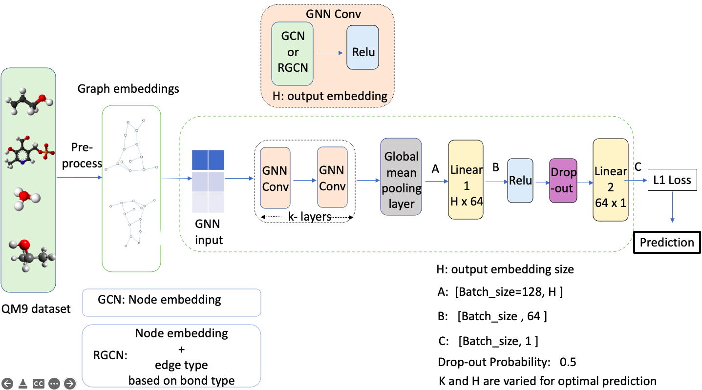
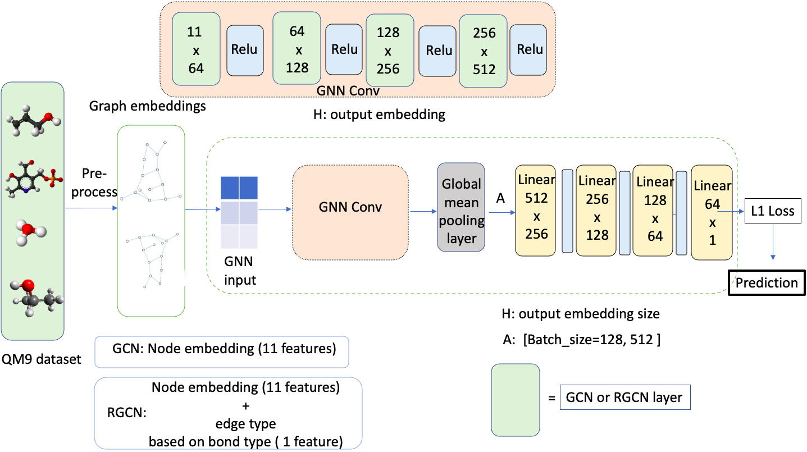
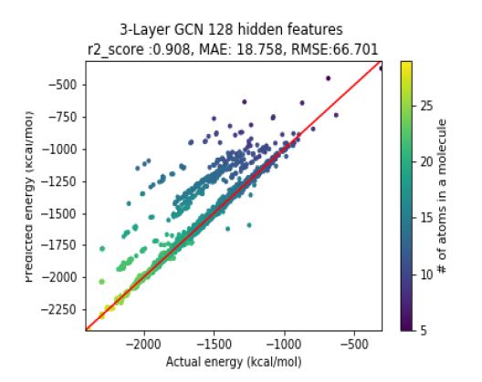
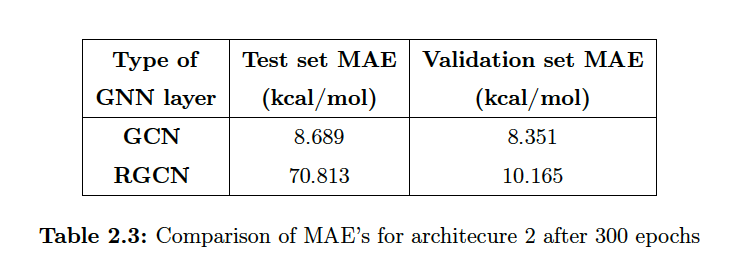
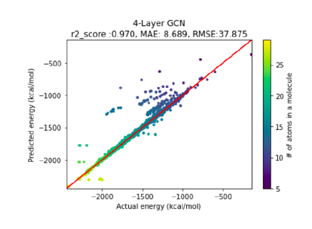

# Atomisation Energy Prediction using Graph Neural Network (GNN)

## Introduction
In this work, we investigate the use of Graph NN's to predict atomisation energy at 0K for molecules with the QM9 dataset [1]) so to bypass the use of network input descriptors so called "symmetry functions" without providing the explicit atomic positions. For this purpose, we have used graph convolutional network (GCN) [2] and relational graph convolutional networks (RGCN)[3].

## About dataset 
QM9 dataset [1] consists of 134k smallest organic molecules containing up to 9 heavy atoms (C, O, N, or F; excluding H) along with their quantum properties which is widely used for molecular property prediction. In this project work, we have used the QM9 dataset from the work "MoleculeNet: A Benchmark for Molecular Machine Learning [4] paper", consisting of same number of molecules as QM9 dataset but with 19 regression targets. We use it to predict
the property "atomization energy at 0 K".

## Data processing  
We have used the built-in QM9 API of the pytorch-geometric package to preprocess and load the QM9 dataset. We split the the dataset  with around 80\%, 10\% and 10\% for the train, validation and the test set respectively. To standardize the the experiments, we use the the same set of dataset indices for train, validation and test set for all models. The target values (atomisation energy $U_{0}$) are normalised for training set only with 0 mean and 1 as standard deviation. We did not normalise the target values for the complete set since it can leak information to validation and test sets.

## Network Architecture
### Programming platform  
Pytorch[5] and pytorch-geometric [6]

### Architecture 1 

### Architecture 2 

## Results
Please refer the report for detailed analysis. Our model with GCN layer in architecture 2 gave better result with respect to architecture model 1 with around 8 kcal/mol of Mean absolute Error (MAE). The work gives a motivation that the further architecture tuning will eventually lead to lesser MAE and achieve chemical accuracy.

## Bibliography
[1] Ramakrishnan, Raghunathan, Dral, Pavlo O, Rupp, Matthias, and Von Lilienfeld, O Anatole. Quantum chemistry structures and properties of 134 kilo
molecules. Scientific data, 1, 2014.
 
[2] Thomas N. Kipf, Max Welling. Semi-Supervised Classification with Graph Convolutional Networks. 
https://doi.org/10.48550/arXiv.1609.02907,2016

[3] Michael Schlichtkrull, Thomas N. Kipf, Peter Bloem, Rianne van den Berg, Ivan Titov, Max Welling.
Modeling Relational Data with Graph Convolutional Networks. 
https://doi.org/10.48550/arXiv.1703.06103.2017

[4] Zhenqin Wu, Bharath Ramsundar, Evan N. Feinberg, Joseph Gomes, Caleb Geniesse, Aneesh S. Pappu, Karl Leswing, Vijay Pande. MoleculeNet: A Benchmark for Molecular Machine Learning. https://doi.org/10.48550/arXiv.1703.00564

[5] https://pytorch.org

[6] https://pytorch-geometric.readthedocs.io/en/latest/index.html  

